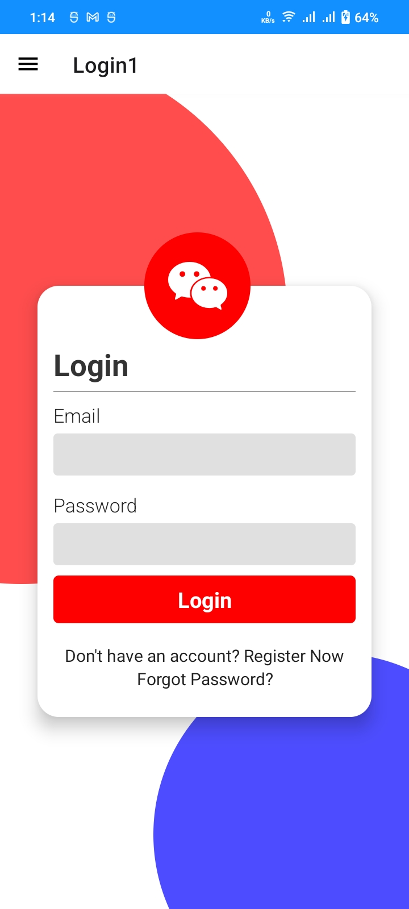

# My App

I made this application for testing purpose.

## Uses 3rd party library on this project

#### React native maps

```bash
  npm install react-native-maps
```

#### React native share

```bash
  npm install react-native-share
```

#### React native vector icons

```bash
  npm install react-native-vector-icons
```

#### React native swiper

```bash
  npm install react-native-swiper
```

#### Lottie React Native

```bash
  npm install lottie-react-native
```

### Login Screen Demo - 1


